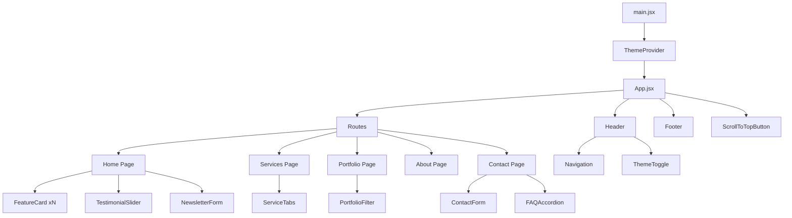

# Component Architecture

## Hierarchy Diagram

## Data Flow

1. `ThemeProvider` stores and exposes `theme` + `toggleTheme`.
2. `ThemeToggle` consumes context and updates global theme.
3. Pages pass data arrays (constants) to child components via props.
4. Interactive components manage local state (`useState`) for UI behavior.
5. Home page fetches stats from `/api/business-data.json` and updates local state.

## State Boundaries

- Global state: theme only.
- Local state: forms, tabs, filters, slider index, accordion open item.

## Benefits

- Predictable one-way data flow.
- Easy to test component behavior.
- Clean separation between route composition and reusable UI units.
